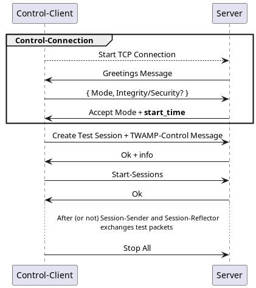

# TWAMP C++ Implementation

TWAMP is a Two-Way Active Measurement Protocol designed to measuring metrics between two
network devices.

Simple Logic Diagram:

```
 +----------------+               +-------------------+
 | Session-Sender |<-TWAMP-Test-->| Session-Reflector |
 +----------------+               +-------------------+
   ^                                     ^
   |                                     |
   |                                     |
   |                                     |
   |  +----------------+<----------------+
   |  |     Utils     |
   |  +----------------+
   |    ^
   |    |
   | TWAMP-Control
   |    |
   v    v
 +----------------+
 | Control-Client |
 +----------------+
```

Overview:

<div style="text-align: center;">
    
</div>

# Modus Operadis

Following [Chapter 5][5] (two-host implementation) from [__RFC 5357__][1] will be the Controller(Client) and
the Responder(Server), which will implement Session-Sender and Session Reflector respectively.

- [ ] TWAMP-Control:
    - [X] Connection Setup
    - [ ] Integrity Protection (Probably will not be implemented) (Implement later with shared-secrets)
    - [ ] TWAMP-Control Commands
    - [ ] Create Test Sessions
    - [ ] Send Schedules
    - [ ] Start Test Sessions
    - [ ] Stop Test Sessions
    - [ ] Fetch Session
- [ ] TWAMP-Test
    - Sender Behaviour
        - [ ] Packet Timings
        - [ ] Packet Format and Content
    - Reflector Behaviour
        - [ ] TWAMP-Test Packet Format and Content

## Connection Setup:

Same as [OWAMP][6], network byte order.

Packet:

``` 
0                   1                   2                   3
0 1 2 3 4 5 6 7 8 9 0 1 2 3 4 5 6 7 8 9 0 1 2 3 4 5 6 7 8 9 0 1
+-+-+-+-+-+-+-+-+-+-+-+-+-+-+-+-+-+-+-+-+-+-+-+-+-+-+-+-+-+-+-+-+
|                                                               |
|                      Unused (12 octets)                       |
|                                                               |
|+-+-+-+-+-+-+-+-+-+-+-+-+-+-+-+-++-+-+-+-+-+-+-+-+-+-+-+-+-+-+-+
|                            Modes                              |
+-+-+-+-+-+-+-+-+-+-+-+-+-+-+-+-+-+-+-+-+-+-+-+-+-+-+-+-+-+-+-+-+
|                                                               |
|                     Challenge (16 octets)                     |
|                                                               |
|                                                               |
+-+-+-+-+-+-+-+-+-+-+-+-+-+-+-+-+-+-+-+-+-+-+-+-+-+-+-+-+-+-+-+-+
|                                                               |
|                        Salt (16 octets)                       |
|                                                               |
|                                                               |
+-+-+-+-+-+-+-+-+-+-+-+-+-+-+-+-+-+-+-+-+-+-+-+-+-+-+-+-+-+-+-+-+
|                        Count (4 octets)                       |
+-+-+-+-+-+-+-+-+-+-+-+-+-+-+-+-+-+-+-+-+-+-+-+-+-+-+-+-+-+-+-+-+
|                                                               |
|                        MBZ (12 octets)                        |
|                                                               |
+-+-+-+-+-+-+-+-+-+-+-+-+-+-+-+-+-+-+-+-+-+-+-+-+-+-+-+-+-+-+-+-+
```

Timestamp:

The format of the timestamp is the same as in [RFC1305] and is as
follows: the first 32 bits represent the unsigned integer number of
seconds elapsed since 0h on 1 January 1900; the next 32 bits
represent the fractional part of a second that has elapsed since
then.

```
0                   1                   2                   3
0 1 2 3 4 5 6 7 8 9 0 1 2 3 4 5 6 7 8 9 0 1 2 3 4 5 6 7 8 9 0 1
+-+-+-+-+-+-+-+-+-+-+-+-+-+-+-+-+-+-+-+-+-+-+-+-+-+-+-+-+-+-+-+-+
|                   Integer part of seconds                     |
+-+-+-+-+-+-+-+-+-+-+-+-+-+-+-+-+-+-+-+-+-+-+-+-+-+-+-+-+-+-+-+-+
|                 Fractional part of seconds                    |
+-+-+-+-+-+-+-+-+-+-+-+-+-+-+-+-+-+-+-+-+-+-+-+-+-+-+-+-+-+-+-+-+
```

After connections is established, client can send the following commands: Request-Session, Start-Sessions,
Stop-Sessions and ~~Fetch-Session~~ (in TWAMP Fetch-Sessions does not exists).

## Creating Test Session

The client sends a `Request-TW-Session` message the same format as described in [Section 3.5][12] of OWAMP, but without the Schedule
Slot Descriptions field(s) and uses only one HMAC. The description of the Request-TW-Session format follows.

```
0                   1                   2                   3
0 1 2 3 4 5 6 7 8 9 0 1 2 3 4 5 6 7 8 9 0 1 2 3 4 5 6 7 8 9 0 1
+-+-+-+-+-+-+-+-+-+-+-+-+-+-+-+-+-+-+-+-+-+-+-+-+-+-+-+-+-+-+-+-+
|   1 [Command] |  MBZ  | IPVN  |  Conf-Sender  | Conf-Receiver |
+-+-+-+-+-+-+-+-+-+-+-+-+-+-+-+-+-+-+-+-+-+-+-+-+-+-+-+-+-+-+-+-+
|                  Number of Schedule Slots                     |
+-+-+-+-+-+-+-+-+-+-+-+-+-+-+-+-+-+-+-+-+-+-+-+-+-+-+-+-+-+-+-+-+
|                      Number of Packets                        |
+-+-+-+-+-+-+-+-+-+-+-+-+-+-+-+-+-+-+-+-+-+-+-+-+-+-+-+-+-+-+-+-+
|          Sender Port          |         Receiver Port         |
+-+-+-+-+-+-+-+-+-+-+-+-+-+-+-+-+-+-+-+-+-+-+-+-+-+-+-+-+-+-+-+-+
|                        Sender Address                         |
+-+-+-+-+-+-+-+-+-+-+-+-+-+-+-+-+-+-+-+-+-+-+-+-+-+-+-+-+-+-+-+-+
|                                                               |
|           Sender Address (cont.) or MBZ (12 octets)           |
|                                                               |
+-+-+-+-+-+-+-+-+-+-+-+-+-+-+-+-+-+-+-+-+-+-+-+-+-+-+-+-+-+-+-+-+
|                        Receiver Address                       |
+-+-+-+-+-+-+-+-+-+-+-+-+-+-+-+-+-+-+-+-+-+-+-+-+-+-+-+-+-+-+-+-+
|                                                               |
|           Receiver Address (cont.) or MBZ (12 octets)         |
|                                                               |
+-+-+-+-+-+-+-+-+-+-+-+-+-+-+-+-+-+-+-+-+-+-+-+-+-+-+-+-+-+-+-+-+
|                                                               |
|                        SID (16 octets)                        |
|                                                               |
|                                                               |
+-+-+-+-+-+-+-+-+-+-+-+-+-+-+-+-+-+-+-+-+-+-+-+-+-+-+-+-+-+-+-+-+
|                         Padding Length                        |
+-+-+-+-+-+-+-+-+-+-+-+-+-+-+-+-+-+-+-+-+-+-+-+-+-+-+-+-+-+-+-+-+
|                           Start Time                          |
|                                                               |
+-+-+-+-+-+-+-+-+-+-+-+-+-+-+-+-+-+-+-+-+-+-+-+-+-+-+-+-+-+-+-+-+
|                       Timeout, (8 octets)                     |
|                                                               |
+-+-+-+-+-+-+-+-+-+-+-+-+-+-+-+-+-+-+-+-+-+-+-+-+-+-+-+-+-+-+-+-+
|                       Type-P Descriptor                       |
+-+-+-+-+-+-+-+-+-+-+-+-+-+-+-+-+-+-+-+-+-+-+-+-+-+-+-+-+-+-+-+-+
|                         MBZ (8 octets)                        |
|                                                               |
+-+-+-+-+-+-+-+-+-+-+-+-+-+-+-+-+-+-+-+-+-+-+-+-+-+-+-+-+-+-+-+-+
|                                                               |
|                       HMAC (16 octets)                        |
|                                                               |
|                                                               |
+-+-+-+-+-+-+-+-+-+-+-+-+-+-+-+-+-+-+-+-+-+-+-+-+-+-+-+-+-+-+-+-+
```

`5` in command is the `Request-TW-Session`, the two-way test session using the TWAMP-Test protocol.

Both the Conf-Sender field and Conf-Receiver field MUST be set to 0 since the Session-Reflector will both receive and send packets, and
the roles are established according to which host initiates the TCP connection for control.

If the IP's of both the Session-Sender and Session-Reflector is the same as
the Control-Client and Server respectively, SenderAddress and ReceiverAddress are set to 0.

The server also creates a SID for this client that will be used for client identity.

The timeout here is to wait for packages that are yet to come after a Stop-Session is sent.
The server MUST not reflect any packet sent after TIMEOUT.


Accept-Session message:
```
```

## Test Session

Session-Sender first sending and then receiving test packets.

## About Floating Point Numbers

The developer had to implement own float [IEEE 754][10] parser to get integral and fractional part
of `timestamp`.

# Dependencies

1. [spdlog](https://github.com/gabime/spdlog)
    1. `pacman -S spdlog`
    2. `sudo apt install libspdlog-dev`

# References

[1]:https://datatracker.ietf.org/doc/html/rfc5357

[2]:https://www.juniper.net/documentation/us/en/software/junos/flow-monitoring/topics/concept/twamp-overview.html

[3]:https://beej.us/guide/bgnet/

[5]:https://datatracker.ietf.org/doc/html/rfc5357#section-5

[6]:https://datatracker.ietf.org/doc/html/rfc4656#section-3.1

[7]:https://stackoverflow.com/questions/283375/detecting-tcp-client-disconnect#:~:text=154,recvXXX()%20when%20reading.

[8]:https://en.wikipedia.org/wiki/Offset_binary

[9]:https://git.musl-libc.org/cgit/musl/tree/src/math/modf.c

[10]:https://en.wikipedia.org/wiki/Double-precision_floating-point_format

[//]: # (RFC)
[11]:https://datatracker.ietf.org/doc/html/rfc5357#section-3.5
[12]:https://datatracker.ietf.org/doc/html/rfc4656#section-3.5

1. [RFC 5357][1]
2. [Understand Two-Way Active Measurement Protocol][2]
3. [Beej's Guide to Network Programming][3]
4. [Socket Disconnected][7]

# Other Beloin's Projects

1. [Swarm Engine](https://github.com/Beloin/SwarmEngine)
1. [Distributed Game](https://github.com/Beloin/DistributedGame)
1. [Swarm Engine](https://github.com/Beloin/LCD_Rasp_Weather)

